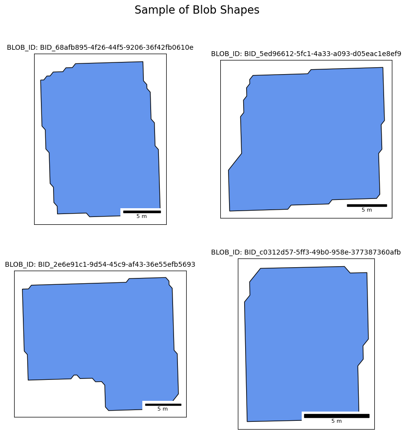

# matching_optimization

By Samuel Alter

🚧 Under Construction 🚧

## Overview

This project is designed to showcase how to improve the speed of a **polygon matching procedure**. 

For this project, I am comparing two similar approaches, albeit with key differences in their executions, and use terms like **_"geospatial-native"_** or **_"geosptially-optimized"_** when describing and running them. A **_geospatially-optimized_** approach uses the latest tools and techniques to make geospatial data processing efficient, while a **_"geospatially-naive"_** or a **_"geospatially non-optimized"_** approach as one that does not take full advantage of the latest advances in geospatial data engineering and analysis.

There are two main areas that could benefit from taking a geospatial-native approach:

1. Data encoding, fetching, and storage
2. Searching for overlaps

I use both a non-geospatial-native and geospatial-native approach to matching blos in a dataset. We will benchmark the execution time, CPU usage, and memory usage for both to see how they differ, with the implicit hypothesis being that the geospatial-native approaches will be more efficient and process more quickly.

Therefore, this project is divided into **two parts**:

1. **Geospatially-non-optimized**
   * Encoding spatial data as strings
   * Storing data in a Postgres database
   * Using GeoPandas for polygon matching
2. **Geospatially-optimized**
   * Under construction...
   * Under construction...

## Table of Contents 

1. [Geospatially Naive Approach](#naive)
2. Under Construction...
3. [Challenges and Solutions](#challenges)

## 1. Non-Optimized Method

One can go about this in a myriad of ways, but my process involved the following:

🚧 Under Construction 🚧

I downloaded a sampling of the data, specifically polygons from 2024, between the months of March and July. On a map, they look like this:

The blobs seem to be located in four major cities in Texas: Dallas, Austin, Houston, and San Antonio.

We can zoom in on a sample of the polygons. Note that the blobs are very small, and their shapes are complex with many vertices. This will increase the storage requirements and thus retrieval times.

We were able to view a sampling of the polygons to confirm that they were indeed matches:

## Challenges and Solutions 

* Matching was returning no results
  > I confirmed on QGIS that there were indeed overlaps, so I **reduced the resolution of the geohash** which allowed for a larger pre-filtering window.
  > I also made the polygons bigger in testing to increase the chances that there will be an overlap.
* Similarly, matching/overlapping code does not find all true overlaps
  > Decrease the precision of the geohash prefiltering so that more candidates are included and not just exact matches. If the precision is too high, only exact matches will be included. 
* How to keep track of execution time, CPU and memory usage?
  > I used the `logging` library and add it as a decorator to the functions that I want to track.
* Multiprocessing with logging was creating log files for every batch
  > I edited the timing decorator function and wrapped the parallel matching function series in a larger function so that I could control the logging.
* Multiprocessing was not working properly
  > I used a combination of:
  > * Dynamic Batching: The code splits the work into batches (chunks) based on your data size and a calculated batch size. If you increase the data 5-fold or even 100-fold, it will create more batches accordingly.
	> * Controlled Worker Parallelism: The number of concurrent workers is controlled by the num_workers parameter. You can adjust this value to match the available hardware resources. The Pool approach ensures that all workers are kept busy until all batches are processed.
	> * Overall Logging: The logging captures overall metrics—total execution time, CPU usage, and memory usage for the complete operation. This provides you with a global performance summary, regardless of the number of workers or batches used.
* Downloading data from Postgres database
  > The overall dataset is large, so I had to employ chunking to download in batches so as not to overload the database with requests.