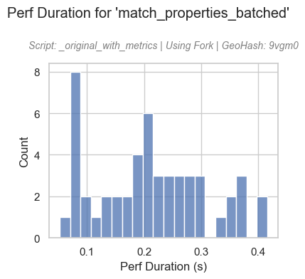

# matching_optimization

By Samuel Alter

## Introduction

This project is designed to investigate how to improve the speed of a **polygon matching procedure**.

**The [results](#results) of the work yielded a 40x increase in the speed of the matching.**

The data is of building shapes in four municipal areas in Texas:

The areas appear to be in four major cities in Texas: Dallas, Austin, Houston, and San Antonio.

We can zoom in on a sample of the polygons. Note that the blobs are very small, and their shapes are complex with many vertices. This will increase the storage requirements and thus retrieval times.

## Work Timeline

The flow of work for this project was as follows:
1. Isolate blob matching functions within `BlobSearchBusinesssClass.py`
2. Expand scope to supporting functions and scripts
3. Refocus with just the `BlobMatchingBusinessClass.py` script
4. Write benchmarking tools to measure and analyze performance of script
  * @Timer decorator
  * @ErrorCatcher decorator
  * Results analysis CLI script
5. Add logging messages and benchmarking hooks throughout script
6. Get performance results with limited, 835-row sample dataset
7. Get performance results with larger, ~6,000-row sample dataset
8. Swap `spawn` for `fork` in the `set_start_method` of multiprocessing:
  * `mp.set_start_method('fork', force=True)`
9. Determine which functions within script are least efficient

## Performance Results

Here are selections of the performance results of the smaller and larger sample datasets:

### Execution Time

### Function Calls over Time

### Memory Change per Function Call

### Select Histograms

### Top 10 Functions by Total Time

## Results 

Given the complexity of the script that we're trying to optimize, any change had effects to multiple other areas of the function. In the end, I realized that changing the way the multiprocessing handles child processes has a huge impact on the total execution time.

